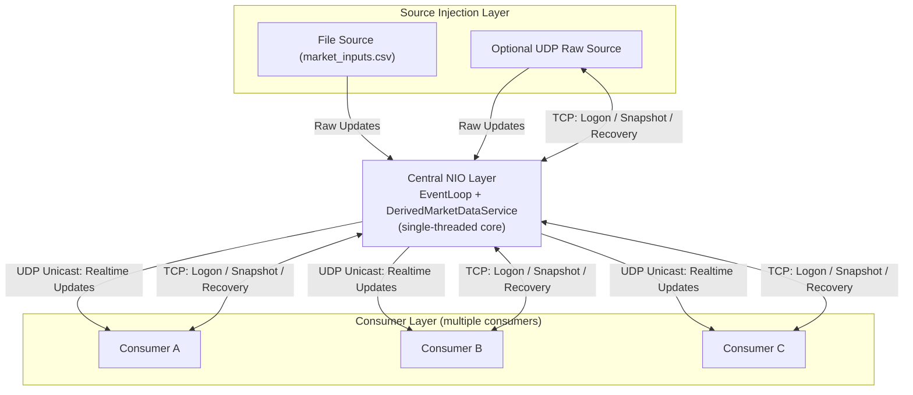

# MarketDataPublisher Skeleton

Initial skeleton for a latency-sensitive market data publisher service.

## Engineering Notes (Exercise Summary)

### Assumptions

- This is a market-data style workload where consumers do not require every update in strict order.
- UDP unicast publication is acceptable for downstream delivery because it prioritizes low latency and naturally isolates slow consumers, which simplifies backpressure handling.

### Trade-offs and Rationale

- The main trade-off considered was **TCP reliability + ordered delivery** vs **UDP latency + operational simplicity**.
- The implementation favors UDP for the realtime update stream to reduce latency overhead and avoid per-consumer blocking behavior.

### What I Would Improve with More Time
- Overall speed of the file processing is very slow. This is mainly because parsing logic. That can be improved.
- Make the implementation more GC-friendly through broader preallocation and tighter collection choices on hot paths.
- Improve CSV publication encoding so consumers can decode binary-friendly payloads without mandatory string parsing.
- Add richer admin/observability surfaces to track queue depth, rejection paths, and end-to-end update flow health.
- On the consumer side, support TCP based recovery when the UDP packets are lost.
- On the consumer side, support TCP based initial view publication after the logon.
- Support similar recovery and rewind capability on the service to request missed raw updates from the source
- Review the AI generated code and optimize it for performance and maintainability.
- Add more 

### Short Time Log

- 1 hour** – Created the initial high-level design, covering separation of the event loop, sources, consumers, and service components. 
- 1 hour** – Implemented the source injection layer, integrating the file source into the NIO event loops and providing support for UDP-based input.
- 1 minutes** – Created the service layer and implemented the derived state management.
- 1 hour** – Designed and implemented the Consumer and Subscription components in detail.
- 1 hour** – Wrapped up the implementation, performed testing, and completed the documentation.

### Consciously Rejected Design Choice

- Multi-threaded/concurrency-heavy processing**: rejected because a single-threaded NIO selector loop is a better fit for predictable latency and avoids coordination overhead for this problem size.

### How AI Was Used

- Used Codex to accelerate implementation and refactoring of Java NIO/event-loop wiring, listener boundaries, CLI argument handling, and test scaffolding.
- Used it iteratively as an engineering assistant (generate → review → correct) rather than copy/paste output, including validating trade-offs against low-latency design goals from day-to-day production experience.

## Design



In this model, TCP is the control plane (logon, snapshot, recovery) and UDP is the data plane for low-latency realtime publication to each consumer.

## Running the Application (Examples)

Build first:

```bash
mvn -q -DskipTests package
```

1. **File-only mode (mandatory argument only)**  
   Starts immediately and logs derived CSV updates to console.

```bash
java -cp target/classes com.bj.marketdata.MarketDataPublisherApplication \
  --raw_updates tests/resources/market-raw-updates-sample.csv
```

2. **Consumer-connect mode (mandatory + optional endpoints)**  
   Waits for TCP consumer logon, then publishes realtime derived updates over UDP.

```bash
java -cp target/classes com.bj.marketdata.MarketDataPublisherApplication \
  --raw_updates tests/resources/market-raw-updates-sample.csv \
  --consumer.logon tcp://127.0.0.1:7001 \
  --consumer.update udp://127.0.0.1:7002
```

3. **Production-style path and explicit bind addresses**  
   Reads a production CSV file and exposes consumer endpoints on chosen interfaces/ports.

```bash
java -cp target/classes com.bj.marketdata.MarketDataPublisherApplication \
  --raw_updates /data/market_inputs.csv \
  --consumer.logon tcp://0.0.0.0:9101 \
  --consumer.update udp://0.0.0.0:9102
```

## Base Package

`com.bj.marketdata`

## Modules

1. `service`
   - `DerivedMarketDataService`: holds derived market data state.
   - Exposes APIs to update and read state.

2. `consumer`
   - `Subscription`: consumer subscription model.
   - Downstream publication handling contracts.

3. `multiplexer`
   - NIO selector/event-loop contract.
   - Readable/writable socket handling contract.

4. `source`
   - Source abstraction for raw updates.
   - `MarketUpdateRawFileSource` placeholder for file-based updates.
   - `UdpSource` placeholder for UDP-based updates.

5. `admin`
   - Admin/tapping entry points for observability.
   - Progress tracking, rejected-update counts, subscription-level visibility contracts.

## Current Status

- Skeleton only.
- No business or networking implementation yet.
- Interfaces and placeholder classes are created for step-by-step implementation.
- Maven project with JUnit 5 tests (unit + integration separation).

## Test Skeleton

Test folders are created under `tests/com/bj/marketdata`:

- `service`
- `consumer`
- `multiplexer`
- `source`
- `admin`
- `main` (bootstrap test)

## Main Test + Properties

- Main test entry: `com.bj.marketdata.main.MarketDataPublisherBootstrapTest`
- Properties file: `tests/resources/market-data-publisher-test.properties`

## Build and Test (Maven)

```bash
mvn test
mvn verify
```

`mvn test` runs low-level unit tests.  
`mvn verify` runs both unit tests and integration tests (`*IntegrationTest`).
